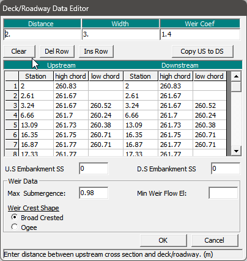

HECRAS has a weird file format that is not completely consistent.
Summary:
- some fields are fixed width
- some fields with multiple values are comma delimited
- fields are NEVER space delimited, instead they are fixed width with no separator
- all examples here are copied from a geometry file, all examples have the correct formatting even if it looks wrong

## General
- the file is laid out with repeating sections
- sections sometimes have a blank line separating them
  - however, sections themselves can have random newlines in them
- the order of properties is inconsistent, especially properties within a section 


properties are in Key=Value format (except for long text fields, see below)
The "Key" is usually sentence cased with spaces
```
Storage Area=2D_Grid
Geom Title=Mitigation 02
```

Sometimes it is a mixture of spaces and no spaces
```
Storage Area 2D PointsPerimeterTime=21May2025 13:18:09
Conn OverFlow Method 2D=True
```

Sometimes it has colons which usually specify a nested object
```
Conn BR: BR SE=1,0
Conn BR: XS SE=2,0
```

**Values can be in several formats**

The most important detail is that values are sometimes fixed-width and sometimes are not!

Fixed width values **always** need to be their exact width.

Fixed Width Values
If a value is fixed width, it is a power of 2 (see note 1) (2,4,8,16,32,etc)

Note 1: I believe it is always a power, but HECRAS is inconsistent and *may* break this rule somewhere but always assume it doesn't

examples:
"```Connection Up SA=2D_Grid         ```"
"```Storage Area=2D_Grid         ,,```"


Non-fixed width examples (but they still have a limit)


"```Geom Title=Mitigation 02```"
"```2D Face Min Length Ratio=0.05```"

Single value
```
2D Face Min Length Ratio=0.0
Storage Area Mannings=0.06
Connection Desc=Dimensions assumed by KGS 2024
```

Multiple values
A value can have multiple values. These are either single line or multiple lines.

Single line* multiple values
notice spaces before and after the numbers, this is because the number can be longer in which, the spaces would not be there. do not assume the spaces are there, but always assume the width is fixed.

```
Viewing Rectangle= 482887.562984754 , 486224.503180069 , 4752418.05198486 , 4749535.47 
```

*sometimes they continue over into a new line
As to when or why they decide to continue over is not clear.
```
Connection Culv=1,1.2,1.2,12.51,0.024,0.5,1,56,1,263.65,263.38, 1 ,Culvert #1  , 0 ,
     4.1     4.1
```

Notes:
- The "Viewing Rectangle" value is 67 characters wide (including commas and spaces). If you omit commas, it is 64 characters. Not sure if this coincidence or not.

### Multiline, multiple values
This is where you need to play **VERY** close attention.

Lets look at three very different examples

Example 1
```
Storage Area Surface Line= 6 
483730.859031855 4751219.0960161                
483740.7548881814751244.70882071                
483745.0677738884751268.34428934                
483748.6587646064751291.68572901                
483752.2215278274751314.88153067                
483752.8485621374751339.96290305 
```
Example 2
```
Storage Area 2D Points= 8 
483813.4292227454751366.80032096483751.5905954734751168.36503865
483809.1969629134751312.72041876483744.0849843064751228.70409084
483290.107524941 4751088.9441675 483723.39188456 4751138.7829585
483725.378001649 4751126.1986775 483362.711387054750999.01840593
Storage Area 2D PointsPerimeterTime=21May2025 13:18:09
```
Example 3
```
Conn Weir SE= 8 
       0 261.716    1.54  261.71   1.999 261.726   2.507 261.691   6.573 261.748
   7.127 261.739   7.589 261.712   10.04  261.72
```
These are grouped where the first line lists the number of values

Complete Non-sense values that follow no logical format
Similar to multiline, multiple values, sometimes fields are stored somewhat like a table, example:
```
Conn BR: Deck Dist Width WeirC Skew NumUp NumDn MinLoCord MaxHiCord MaxSubmerge Is_Ogee
2,3,1.4,0, 11, 11, , , 0.98, 0, 0,0,0,0
       2    2.61    3.24    3.24    6.66   13.09   16.35   16.87   16.87   17.33
   17.78
  260.83  261.67  261.67  261.67   261.7  261.73  261.75  261.77  261.77  261.77
  261.05
                          260.52  260.24  260.38  260.71  260.71                
        
       2    2.61    3.24    3.24    6.66   13.09   16.35   16.87   16.87   17.33
   17.78
  260.83  261.67  261.67  261.67   261.7  261.73  261.75  261.77  261.77  261.77
  261.05
                          260.52  260.24  260.38  260.71  260.71
```

which I mean like... what the fuck? what are the rules here?
It corresponds to this UI in HECRAS



Like Is_Ogee now follows snakecase???


Multiline text fields
Sometimes HECRAS allows the user to enter long description fields. These are formatted differently that key=value pairs. 

They are instead surrounded by "BEGIN *PROPERTYNAME*:" and "END *PROPERTYNAME*:"

Examples are:
```
BEGIN GEOM DESCRIPTION:
Upsize Culvert 43 and 44 from 0.9 to 1.5m
END GEOM DESCRIPTION:

BEGIN GEOM DESCRIPTION:
Upsize Culvert 43 and 44 from 0.9 to 1.5m
Also add another thing
and also this thing
END GEOM DESCRIPTION:
```

Notes: unsure if there is a maximum number of lines or maximum line width

Geometry file